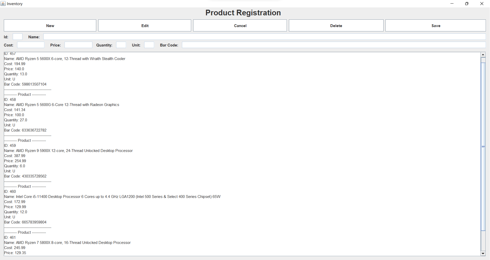

English

# Inventory Control

## About the project

A program made in Java for simple inventory control. The program implements a graphical interface using the javax.swing package, has data storage and follows MVC (Model-view-controller) code standards.

## Build

The project follows Maven standards and can be built like any Maven project.

## How to Use

By default, the program starts with data fields disabled.

* **Enter a new product:** Click the "New" button, this will enable the data fields. After that, enter the desired data and click the "Save" button to save the product.
* **Edit a product:** Click the "Edit" button, a pop-up will appear asking the user to enter the ID of the product they want to edit, enter the ID and click the confirm button. The product information will appear in the data fields, just edit them as you wish and click the "Save" button to update the registration.
* **Delete a product:** Click on the "Delete" button, a pop-up will appear asking the user to enter the ID of the product they want to delete, enter the ID and click on the confirmation button. The product with the given ID will be deleted.
* **Cancel a registration insertion/editing:** When entering or modifying registration data, the user can click at any time on the "Cancel" button to cancel the operation.

 

Português

# Controle de Estoque

## Sobre o Projeto

Um programa feito em Java para controle de estoque simples. O programa implementa uma interface gráfica usando o pacote javax.swing, possui armazenamento de dados e segue os padrões de código MVC(Model-view-controller).

## Build

O projeto segue os padrões do Maven e seu build pode ser feito como qualquer projeto Maven.

## Como Usar

Por padrão, o programa começa com os campos de dados desabilitados.

* **Inserir um novo produto:** Clique no botão "New", isso habilitará os campos de dados. Após isso, insira os dados desejadoe e clique no botão "Save" para salvar o produto.
* **Editar um produto:** Clique no botão "Edit", um pop-up aparecerá pedindo que o usuário informe o ID do produto que deseja editar, informe o ID e clique no botão de confirmação. As informações do produto aparecerão nos campos de dados, basta editá-las como quiser e clicar no botão "Save" para atualizar o cadastro.
* **Deletar um produto:** Clique no botão "Delete", um pop-up aparecerá pedindo que o usuário informe o ID do produto que deseja deletar, informe o ID e clique no botão de confirmação. O produto com o ID informado será deletado.
* **Cancelar uma inserção/edição de cadastro:** Ao inserir ou modificar os dados de um cadastro, o usuário pode clicar a qualquer momento no botão "Cancel" para cancelar a operação.

 

